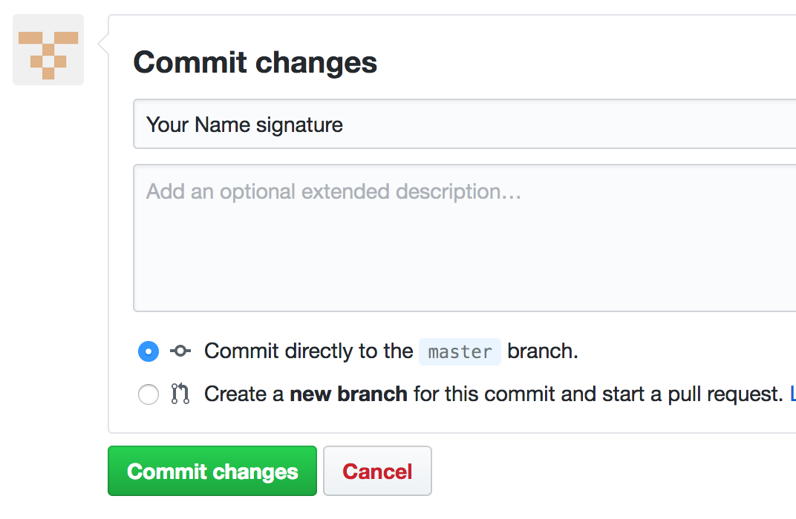

= Codewriting Contracts
:git_repo_url: test
ifndef::env-github[:icons: font]
ifdef::env-github[]
:caution-caption: :fire:
:important-caption: :exclamation:
:note-caption: :paperclip:
:tip-caption: :bulb:
:warning-caption: :warning:
endif::[]

This repository contains the prime version of contract language originating with the Codewriting project.

They are intended to be forked, modified (collaboratively, when applicable), and then digitally signed by all parties in a manner far more secure, verifiable, and traceable than standard digital-signing methods.

[[auth-auth-instructions]]
== Authentication and Authorization Instructions

Documents in this repository are intended to be “signed” using a distributed version control system, specifically the completely free, open-source platform link:https://git-scm.com/[Git].

There are three Git-based signing options available.
A free account on GitHub will be required to <<github-signing,read and sign via web browser>> or for <<GPG-authenticated signing>>.
A third option exists for <<simple-git-signing,simple signing without a GitHub account>>.

[IMPORTANT]
Both *GPG-authenticated signing* and *signing without GitHub* require Git be installed on the signer's computer and some familiarity with Git command-line operations.

[TIP]
Instead of GitHub, these procedures can be carried out using other popular Git platforms, including GitLab and BitBucket, both of which offer GPG signing.

[[github-signing]]
=== Method 1: Simple GitHub Signing

This method requires a link:https://github.com/join[free GitHub account] but _not_ an encryption signature or a local installation of Git.

. View the document online at the source shared with you (appears before *Digital Contract*).

. Click the edit link to expose the raw, editable document source in your browser, near the top-right corner of the document pane.
+

. Scroll down to the section marked `\[[signature-page]]`.
+
[source,asciidoc]
----
[[signature-page]]
== Signature Page
----

. *Type your complete name and the date* of signing to the source file in the appropriate fields of the *Signature Page*.
+
[source,asciidoc]
----
| *Representative's signature:*
| Fran Johansen

| *Date:*
| September 21, 2019
----

. Under *Commit changes*, enter a message indicating you have signed the document and click *Commit changes*.
+

[[gpg-signing]]
=== Method 2: GPG-Authenticated Signing

[IMPORTANT]
These instructions require that you have a GPG key associated with the e-mail address with which you perform business as well as a link:https://github.com/join[free GitHub account].
GitHub instructs link:https://help.github.com/articles/generating-a-new-gpg-key[generating a GPG key], link:https://help.github.com/articles/checking-for-existing-gpg-keys[checking if you already have one], and link:https://help.github.com/articles/adding-a-new-gpg-key-to-your-github-account[linking it to your GitHub account].
After this process, you may need to link:https://help.github.com/articles/telling-git-about-your-signing-key/[configure your local Git to use a particular key].

. Clone the repository to your local system.
+
[source,shell,subs=+asciidoc]
----
git clone {git_repo_url}
----

. Open the document in a text editor of your choice.

. Scroll down to the section marked `\[[signature-page]]`.
+
[source,asciidoc]
----
[[signature-page]]
== Signature Page
----

. *Type your complete name and the date* of signing to the source file in the appropriate fields of the *Signature Page*.
+
[source,asciidoc]
----
| *Representative's signature:*
| Fran Johansen

| *Date:*
| September 21, 2019
----

. Commit and digitally sign the changes using command-line Git.
+
[source,bash]
git commit -am "Fran Johansen signature" -S
+
* Replace `Your Name` with your full name. +
* The `-S` flag instructs GPG signing.

. Push the changes back to the origin repo.
+
[source,bash]
git push -u origin master

[[basic-git-signing]]
=== Method 3: Basic Non-GitHub Git Signing

[WARNING]
This method offers minimal if any authentication enhancement.
See <<considerations>> for more.

. Clone the repository to your local system using the Git command-line interface or another Git client, such as GitHub desktop (does not require GitHub account).
+
.Command-line example
[source,shell,subs=+asciidoc]
git clone {git_repo_url}

. Open the document in a text editor of your choice.

. Scroll down to the section marked `\[[signature-page]]`.
+
[source,asciidoc]
----
[[signature-page]]
== Signature Page
----

. *Type your complete name and the date* of signing to the source file in the appropriate fields of the *Signature Page*.
+
[source,asciidoc]
----
| *Representative's signature:*
| Fran Johansen

| *Date:*
| September 21, 2019
----

. Commit the changes using command-line Git.
+
[source,bash]
git commit -am "Your Name signature"
+
* Replace `Your Name` with your full name. +

. Push the changes back to the origin repo.
+
[source,bash]
git push -u origin master

[[considerations]]
== Authentication and Authorization Considerations

All three options for digitally signing a contract using the Git method instructed here likely have different legal implications.
I am not an appropriate source, and this is not an appropriate venue, for anything approaching legal advice.
However, some conclusions can be drawn from the various degrees of authentication provided.

*Method 1* provides for authenticity to the degree each signer's GitHub account does.
If the GH account uses their business e-mail address, this will serve as fairly strong validation, since GH requires e-mail verification.
A GH account can also be considered authentic to the extent its owner links to it from other services, such as an official website, social media accounts, etc.

*Method 2* is obviously the most secure, as it combines GitHub authentication with GPG crypto signing, though both elements of this authentication method are open to evaluation.
As with Method 1, a GitHub account only provides authenticity where it is referenced by other entities, such as links to the GH account from official places.

A GPG key by default has even less verification than a GH account.
GH keys are again only as powerful as their social imprint.
GPG keys can be verified by other GPG users, though this networked authentication is fairly weak.
The most reliable way to verify that a given GPG signature is authentically associated with a real-world identity is to expose the public key from the GPG-keypair in use.
Posting the keypair's fingerprint or public key in official places like websites and social media is a great way to establish authenticity.

*Method 3* involves very little identity authentication.
Even though each committing user's e-mail address and name are shown in the commit metadata, these can be freely set and are unverified.
Method 3 only makes sense when there is no chance of a dispute over _who_ signed the documents, and it's just a matter of tracking which precise versions were signed.

== Collaborative Drafting

Lots of contracts involve back and forth, at which point tracking changes is essential.
This being Git's main job, we are in good hands, as text documents can be collaborated on just like code files.
In fact, AsciiDoc files _are_ code files.

The workflow for contract drafting is usually pretty simple and can be done using the Pull Request method.
In fact, the initiator of the contract drafting and signing procedure should set up a Pull Request right from the start.

// TODO Finish this section
